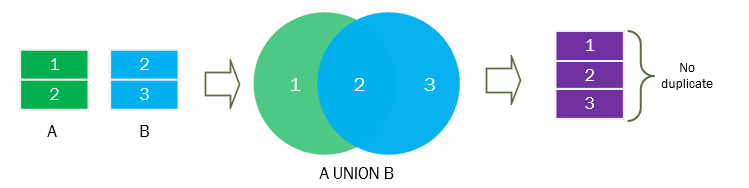
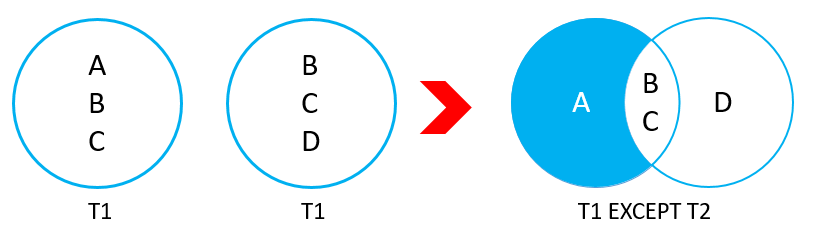
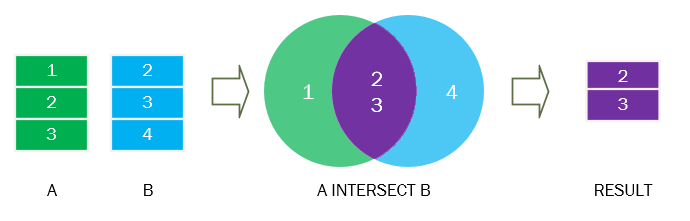

## Union operators

`Операторы объединения` в SQL используются для объединения результатов дух или более запросов в один набор данных

- `UNION` используется для объединения результатов двух или более запросов в один набор данных. Для использования `UNION`, все запросы должны возвращать одинаковое количество столбцов, и типы данных в каждом столбце должны быть совместимыми.

``` sql
-- Базовый синтаксис
SELECT column_name FROM table1
UNION
SELECT column_name FROM table2;
```


- `EXCEPT` используется для возвращения строк из первого запроса, которые не присутствуют во втором запросе.
``` sql
-- Базовый синтаксис
SELECT column_name FROM table1
EXCEPT
SELECT column_name FROM table2;
```

- `INTERSECT` используется для возвращения строк, которые присутствуют в результатах обоих запросов. Это означает, что INTERSECT возвращает пересечение двух наборов данных. Если строка присутствует в обоих запросах, она будет включена в результат.

``` sql
-- Базовый синтаксис
SELECT column_name FROM table1
INTERSECT
SELECT column_name FROM table2;
```


- Ключевое слово `ALL` сохраняет дубликаты строк в результатах запроса. При использовании вышеперечисленных операторов без использования `ALL` все дубликаты будут удалены из результатов запроса.

`UNION [ALL]`

`EXCEPT [ALL]`

`INTERSECT [ALL]`